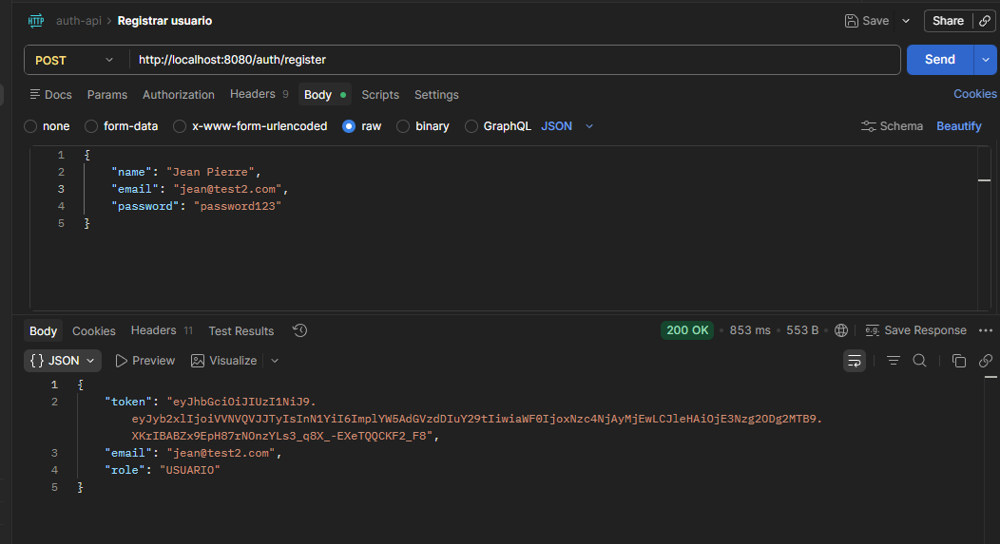
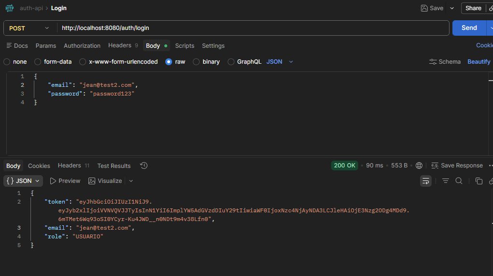
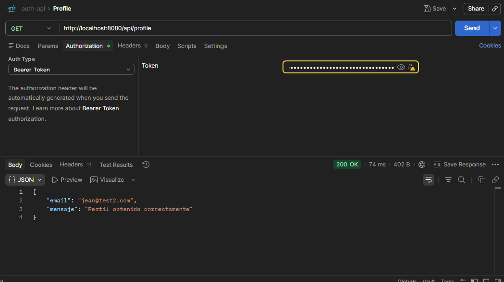

# 🔐 Auth API — JWT Authentication with Spring Boot

REST API de autenticación de usuarios construida con Java y Spring Boot, que implementa seguridad basada en tokens JWT con control de roles.

## 🛠️ Stack tecnológico

- **Java 22** + **Spring Boot 4**
- **Spring Security 7** — seguridad y filtros
- **JWT (jjwt 0.12.3)** — generación y validación de tokens
- **PostgreSQL** — base de datos relacional
- **JPA / Hibernate** — persistencia de datos
- **Lombok** — reducción de código repetitivo
- **JUnit5 + Mockito** — pruebas unitarias (80%+ cobertura)
- **Docker** — contenedorización

## 📋 Endpoints

| Método | Endpoint | Descripción | Auth |
|--------|----------|-------------|------|
| POST | `/auth/register` | Registrar nuevo usuario | ❌ |
| POST | `/auth/login` | Login y obtener JWT | ❌ |
| GET | `/api/profile` | Obtener perfil del usuario | ✅ |
| GET | `/api/admin/dashboard` | Panel de administración | ✅ ADMIN |

## 🔒 Seguridad

- Contraseñas encriptadas con **BCrypt**
- Tokens **JWT** firmados con clave secreta
- Rutas protegidas mediante **Spring Security Filter Chain**
- Control de acceso por roles: **USER** y **ADMIN**
- Sesiones **stateless** — sin cookies ni sesiones del servidor

## 📸 Demostración

### Registro de usuario


### Login


### Ruta protegida con JWT


Antes de correr el proyecto configura estas variables de entorno:

## ⚙️ Configuración
| Variable | Descripción | Ejemplo |
|---|---|---|
| `DB_URL` | URL de PostgreSQL | `jdbc:postgresql://localhost:5432/auth_db` |
| `DB_USER` | Usuario de PostgreSQL | `postgres` |
| `DB_PASSWORD` | Contraseña de PostgreSQL | `tu_password` |
| `JWT_SECRET` | Clave secreta JWT (mín. 32 caracteres) | `mi_clave_super_secreta_32chars` |


## ⚙️ Cómo correr el proyecto localmente

### Requisitos
- Java 22
- Maven
- PostgreSQL

### Pasos

1. Clona el repositorio en un git bash:

```bash
   git clone https://github.com/Jean0124/auth-api.git
```

2. Crea la base de datos en postgreSQL:

```sql
CREATE DATABASE auth_db;
```


3. Configura tus credenciales en `src/main/resources/application.properties`


4. Corre el proyecto en la consola o en un IDE:

```bash
./mvnw spring-boot:run
```

5. La API estará disponible en `http://localhost:8080`

## 🧪 Correr pruebas unitarias

usar el comando : 
```bash
./mvnw test
```

Resultado esperado:

Tests run: 9, Failures: 0, Errors: 0


## 📁 Estructura del proyecto

```
src/
├── main/java/com/api/autentificacion/auth_api/
│   ├── config/
│   │   ├── ApplicationConfig.java
│   │   └── SecurityConfig.java
│   ├── controller/
│   │   ├── AuthController.java
│   │   └── UserController.java
│   ├── dto/
│   │   ├── AuthResponse.java
│   │   ├── LoginRequest.java
│   │   └── RegisterRequest.java
│   ├── model/
│   │   ├── Role.java
│   │   └── User.java
│   ├── repository/
│   │   └── UserRepository.java
│   ├── security/
│   │   └── JwtFilter.java
│   └── service/
│       ├── AuthService.java
│       ├── JwtService.java
│       └── PasswordEncoderService.java
└── test/
└── service/
├── AuthServiceTest.java
└── JwtServiceTest.java
```

## 🧠 Conceptos aplicados

- Arquitectura en capas (Controller → Service → Repository)
- Clean Code y principios SOLID
- Pruebas unitarias con mocks (Mockito)
- Seguridad stateless con JWT
- Manejo de excepciones
- Validación de datos de entrada

## 👨‍💻 Autor

**Jean Pierre Villamil Sanchez**  
[LinkedIn](https://www.linkedin.com/in/jean0124) · [GitHub](https://github.com/Jean0124)